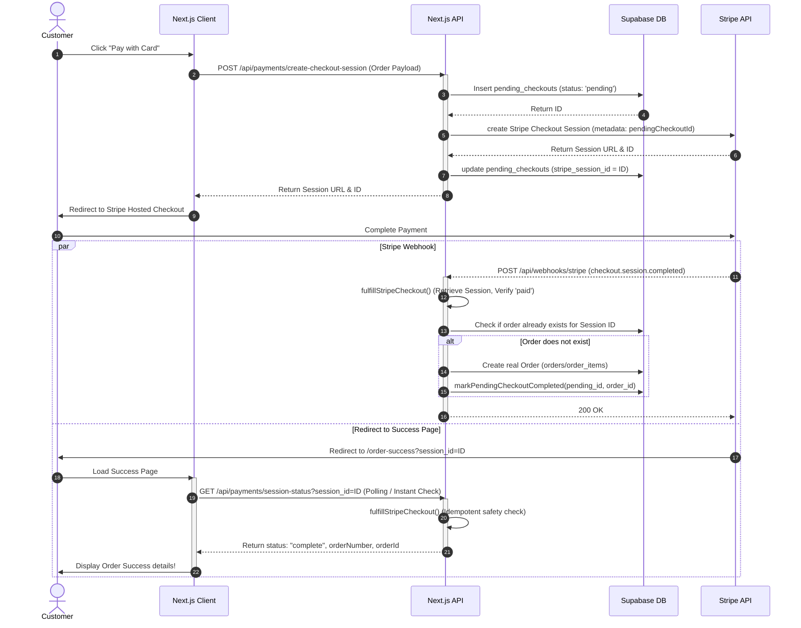

# Stripe Checkout Integration Guide & LLM Master Prompt

This document describes a robust, production-ready Stripe Checkout flow with offline recovery. It uses Next.js App Router (React), Supabase (PostgreSQL), and the Stripe SDK.

The implementation relies on the **Pending Checkout Pattern** to ensure no orders are lost due to closed browsers, network drops, or delayed webhooks, while maintaining complete idempotency to prevent duplicate orders.

---

## 1. Architectural Overview



### Key Safety & Reliability Features
1. **No Data Loss on Payment Success**: Before the customer is redirected to Stripe, their order data (cart items, shipping address, email) is persisted in the database as a `pending_checkout` JSON payload. Even if they close the browser tab after payment, the webhook will reconstruct the order from this payload.
2. **Double-Fulfillment Protection (Idempotency)**: The `fulfillStripeCheckout` function is idempotent. Both the webhook route and the client-facing `/api/payments/session-status` route call it. The database enforces a `unique` constraint on the `stripe_checkout_session_id` column. If an order already exists for a session, it is immediately returned, preventing duplicate orders.
3. **Optimistic Local Fallback**: When Supabase is not configured (e.g., local testing), the system gracefully falls back to memory maps for testing.

---

## 2. Database Schema (PostgreSQL / Supabase)

Create a migration (e.g., `20260710_stripe_checkout.sql`) to prepare the schema:

```sql
-- 1. Add online card option to payment method enum (if applicable)
do $$ begin
  alter type payment_method add value if not exists 'card_online';
exception when duplicate_object then null;
end $$;

-- 2. Add Stripe Session ID to orders for tracking and unique constraint (idempotency)
alter table public.orders
  add column if not exists stripe_checkout_session_id text;

create unique index if not exists orders_stripe_checkout_session_id_uidx
  on public.orders (stripe_checkout_session_id)
  where stripe_checkout_session_id is not null;

-- 3. Create pending_checkouts table to cache payload prior to redirection
create table if not exists public.pending_checkouts (
  id uuid primary key default gen_random_uuid(),
  stripe_session_id text unique,
  payload jsonb not null,
  status text not null default 'pending'
    check (status in ('pending', 'completed', 'expired')),
  order_id uuid references public.orders(id) on delete set null,
  created_at timestamptz not null default now(),
  expires_at timestamptz not null default (now() + interval '24 hours')
);

create index if not exists pending_checkouts_status_idx
  on public.pending_checkouts (status);

-- Enable RLS (and configure admin-only read/write policies as needed)
alter table public.pending_checkouts enable row level security;
```

---

## 3. Implementation Codebase

### 3.1. Environment Variables Configuration

Create a `.env.stripe.example` or update your `.env.local`:

```bash
# Stripe Keys (test mode)
STRIPE_SECRET_KEY=sk_test_...
NEXT_PUBLIC_STRIPE_PUBLISHABLE_KEY=pk_test_...

# Webhook signing secret (from Stripe CLI or Dashboard)
# For local development: stripe listen --forward-to localhost:3000/api/webhooks/stripe
STRIPE_WEBHOOK_SECRET=whsec_...
```

### 3.2. Config and Client Helper

#### `src/lib/payments/stripe-config.ts`
```typescript
export function getStripeSecretKey(): string | undefined {
  return process.env.STRIPE_SECRET_KEY?.trim() || undefined;
}

export function getStripeWebhookSecret(): string | undefined {
  return process.env.STRIPE_WEBHOOK_SECRET?.trim() || undefined;
}

export function getStripePublishableKey(): string | undefined {
  return process.env.NEXT_PUBLIC_STRIPE_PUBLISHABLE_KEY?.trim() || undefined;
}

export function isStripeConfigured(): boolean {
  return Boolean(getStripeSecretKey());
}
```

#### `src/lib/payments/stripe-client.ts`
```typescript
import Stripe from "stripe";
import { getStripeSecretKey } from "./stripe-config";

let stripeClient: Stripe | null = null;

export function getStripeClient(): Stripe {
  const secretKey = getStripeSecretKey();
  if (!secretKey) {
    throw new Error("Stripe is not configured");
  }

  if (!stripeClient) {
    stripeClient = new Stripe(secretKey, {
      apiVersion: "2025-02-24.acacia", // Adjust version as needed
      typescript: true,
    });
  }

  return stripeClient;
}
```

### 3.3. Pending Checkout Helpers

#### `src/lib/payments/pending-checkout.ts`
```typescript
import { createAdminClient } from "@/lib/supabase/admin"; // Or your DB client
import { isSupabaseConfigured } from "@/lib/supabase/env";
import { randomUUID } from "@/lib/random-uuid";
import type { CreateOrderInput } from "@/lib/validation";

export type PendingCheckoutStatus = "pending" | "completed" | "expired";

export interface PendingCheckoutRecord {
  id: string;
  stripeSessionId: string | null;
  payload: CreateOrderInput;
  status: PendingCheckoutStatus;
  orderId: string | null;
}

const memoryPending = new Map<string, PendingCheckoutRecord>();

export async function createPendingCheckout(
  payload: CreateOrderInput
): Promise<PendingCheckoutRecord> {
  const id = randomUUID();
  const record: PendingCheckoutRecord = {
    id,
    stripeSessionId: null,
    payload,
    status: "pending",
    orderId: null,
  };

  if (isSupabaseConfigured) {
    const supabase = createAdminClient();
    if (!supabase) {
      throw new Error("Checkout service is not configured");
    }

    const { error } = await supabase.from("pending_checkouts").insert({
      id,
      payload,
      status: "pending",
    });

    if (error) throw new Error(error.message);
  } else {
    memoryPending.set(id, record);
  }

  return record;
}

export async function attachStripeSessionToPendingCheckout(
  pendingCheckoutId: string,
  stripeSessionId: string
): Promise<void> {
  if (isSupabaseConfigured) {
    const supabase = createAdminClient();
    if (!supabase) throw new Error("Checkout service is not configured");

    const { error } = await supabase
      .from("pending_checkouts")
      .update({ stripe_session_id: stripeSessionId })
      .eq("id", pendingCheckoutId);

    if (error) throw new Error(error.message);
    return;
  }

  const record = memoryPending.get(pendingCheckoutId);
  if (record) {
    record.stripeSessionId = stripeSessionId;
    memoryPending.set(pendingCheckoutId, record);
  }
}

export async function getPendingCheckoutById(
  id: string
): Promise<PendingCheckoutRecord | null> {
  if (isSupabaseConfigured) {
    const supabase = createAdminClient();
    if (!supabase) return null;

    const { data, error } = await supabase
      .from("pending_checkouts")
      .select("id, stripe_session_id, payload, status, order_id")
      .eq("id", id)
      .maybeSingle();

    if (error || !data) return null;

    return {
      id: data.id,
      stripeSessionId: data.stripe_session_id,
      payload: data.payload as CreateOrderInput,
      status: data.status as PendingCheckoutStatus,
      orderId: data.order_id,
    };
  }

  return memoryPending.get(id) ?? null;
}

export async function getPendingCheckoutByStripeSession(
  stripeSessionId: string
): Promise<PendingCheckoutRecord | null> {
  if (isSupabaseConfigured) {
    const supabase = createAdminClient();
    if (!supabase) return null;

    const { data, error } = await supabase
      .from("pending_checkouts")
      .select("id, stripe_session_id, payload, status, order_id")
      .eq("stripe_session_id", stripeSessionId)
      .maybeSingle();

    if (error || !data) return null;

    return {
      id: data.id,
      stripeSessionId: data.stripe_session_id,
      payload: data.payload as CreateOrderInput,
      status: data.status as PendingCheckoutStatus,
      orderId: data.order_id,
    };
  }

  for (const record of memoryPending.values()) {
    if (record.stripeSessionId === stripeSessionId) {
      return record;
    }
  }
  return null;
}

export async function markPendingCheckoutCompleted(
  pendingCheckoutId: string,
  orderId: string
): Promise<void> {
  if (isSupabaseConfigured) {
    const supabase = createAdminClient();
    if (!supabase) return;

    await supabase
      .from("pending_checkouts")
      .update({ status: "completed", order_id: orderId })
      .eq("id", pendingCheckoutId);
    return;
  }

  const record = memoryPending.get(pendingCheckoutId);
  if (record) {
    record.status = "completed";
    record.orderId = orderId;
    memoryPending.set(pendingCheckoutId, record);
  }
}

export async function getOrderByStripeSessionId(
  stripeSessionId: string
): Promise<{ orderId: string; orderNumber: string } | null> {
  if (!isSupabaseConfigured) return null;

  const supabase = createAdminClient();
  if (!supabase) return null;

  const { data, error } = await supabase
    .from("orders")
    .select("id, order_number")
    .eq("stripe_checkout_session_id", stripeSessionId)
    .maybeSingle();

  if (error || !data) return null;

  return { orderId: data.id, orderNumber: data.order_number };
}
```

### 3.4. Create & Fulfill Session Logic

#### `src/lib/payments/create-stripe-session.ts`
```typescript
import Stripe from "stripe";
import { SITE_URL } from "@/lib/seo/site";
import { computeOrderTotals } from "./compute-order-totals";
import { getStripeClient } from "./stripe-client";
import {
  attachStripeSessionToPendingCheckout,
  createPendingCheckout,
} from "./pending-checkout";
import type { CreateOrderInput } from "@/lib/validation";

function eurToStripeCents(totalEur: number): number {
  return Math.round(totalEur * 100);
}

export async function createStripeCheckoutSession(
  input: CreateOrderInput
): Promise<{ sessionId: string; url: string }> {
  // 1. Calculate totals and record pending checkout schema
  const totals = await computeOrderTotals(input);
  const pending = await createPendingCheckout(input);

  const stripe = getStripeClient();
  const successUrl = `${SITE_URL}/order-success?session_id={CHECKOUT_SESSION_ID}`;
  const cancelUrl = `${SITE_URL}/checkout?payment=cancelled`;

  // 2. Build line items
  const lineItems: Stripe.Checkout.SessionCreateParams.LineItem[] =
    totals.lines.map((line) => ({
      price_data: {
        currency: "eur",
        unit_amount: eurToStripeCents(line.totalPrice),
        product_data: {
          name: line.productName,
        },
      },
      quantity: 1,
    }));

  if (totals.deliveryFee > 0) {
    lineItems.push({
      price_data: {
        currency: "eur",
        unit_amount: eurToStripeCents(totals.deliveryFee),
        product_data: {
          name: input.locale === "bg" ? "Доставка" : "Delivery",
        },
      },
      quantity: 1,
    });
  }

  // 3. Request Checkout Session
  const session = await stripe.checkout.sessions.create({
    mode: "payment",
    payment_method_types: ["card"],
    line_items: lineItems,
    success_url: successUrl,
    cancel_url: cancelUrl,
    customer_email: input.customerEmail?.trim() || undefined,
    metadata: {
      pendingCheckoutId: pending.id,
      locale: input.locale,
    },
    locale: input.locale === "en" ? "en" : "bg",
  });

  if (!session.url) {
    throw new Error("Stripe session URL missing");
  }

  // 4. Link the Stripe session ID back to the pending checkout record
  await attachStripeSessionToPendingCheckout(pending.id, session.id);

  return { sessionId: session.id, url: session.url };
}
```

#### `src/lib/payments/fulfill-stripe-checkout.ts`
```typescript
import { createOrder } from "@/lib/orders"; // Replace with your actual order creator function
import { getStripeClient } from "./stripe-client";
import {
  getOrderByStripeSessionId,
  getPendingCheckoutById,
  getPendingCheckoutByStripeSession,
  markPendingCheckoutCompleted,
} from "./pending-checkout";
import type { CreateOrderInput } from "@/lib/validation";

export interface FulfilledCheckout {
  orderId: string;
  orderNumber: string;
  alreadyExisted: boolean;
}

async function resolvePendingCheckout(
  stripeSessionId: string,
  pendingCheckoutId?: string
) {
  if (pendingCheckoutId) {
    const byId = await getPendingCheckoutById(pendingCheckoutId);
    if (byId) return byId;
  }
  return getPendingCheckoutByStripeSession(stripeSessionId);
}

/**
 * Idempotent order generator called by both webhooks and success page polling.
 */
export async function fulfillStripeCheckout(
  stripeSessionId: string,
  pendingCheckoutId?: string
): Promise<FulfilledCheckout | null> {
  // Guard 1: Check if an order already exists for this stripe session
  const existing = await getOrderByStripeSessionId(stripeSessionId);
  if (existing) {
    return {
      orderId: existing.orderId,
      orderNumber: existing.orderNumber,
      alreadyExisted: true,
    };
  }

  const stripe = getStripeClient();
  const session = await stripe.checkout.sessions.retrieve(stripeSessionId);

  // Guard 2: Confirm Stripe indicates transaction completed successfully
  if (session.payment_status !== "paid") {
    return null;
  }

  const checkoutId =
    pendingCheckoutId ?? session.metadata?.pendingCheckoutId ?? undefined;
  const pending = await resolvePendingCheckout(stripeSessionId, checkoutId);

  if (!pending) {
    return null;
  }

  // Guard 3: If checkout status was marked completed and order already bound
  if (pending.status === "completed" && pending.orderId) {
    const order = await getOrderByStripeSessionId(stripeSessionId);
    if (order) {
      return {
        orderId: order.orderId,
        orderNumber: order.orderNumber,
        alreadyExisted: true,
      };
    }
  }

  const payload: CreateOrderInput = {
    ...pending.payload,
    paymentMethod: "card_online",
  };

  // Create real orders and update inventory (wrapped in a DB transaction ideally)
  const { orderId, orderNumber } = await createOrder(payload, {
    stripeCheckoutSessionId: stripeSessionId,
  });

  // Commit completion status to avoid redundant checks
  await markPendingCheckoutCompleted(pending.id, orderId);

  return { orderId, orderNumber, alreadyExisted: false };
}
```

### 3.5. Next.js Route Handlers

#### `src/app/api/payments/create-checkout-session/route.ts`
```typescript
import { NextResponse } from "next/server";
import { createOrderSchema } from "@/lib/validation"; // Replace with your validator
import { createStripeCheckoutSession } from "@/lib/payments/create-stripe-session";
import { isStripeConfigured } from "@/lib/payments/stripe-config";

export async function POST(request: Request) {
  let body: unknown;
  try {
    body = await request.json();
  } catch {
    return NextResponse.json({ success: false, error: "Invalid JSON body" }, { status: 400 });
  }

  if (!isStripeConfigured()) {
    return NextResponse.json({ success: false, error: "Stripe not configured" }, { status: 503 });
  }

  const parsed = createOrderSchema.safeParse(body);
  if (!parsed.success) {
    return NextResponse.json({ success: false, error: "Validation failed" }, { status: 422 });
  }

  if (parsed.data.paymentMethod !== "card_online") {
    return NextResponse.json({ success: false, error: "Invalid payment method" }, { status: 400 });
  }

  try {
    const { sessionId, url } = await createStripeCheckoutSession(parsed.data);
    return NextResponse.json({ success: true, data: { sessionId, url } });
  } catch (err) {
    const message = err instanceof Error ? err.message : "Checkout failed";
    return NextResponse.json({ success: false, error: message }, { status: 400 });
  }
}
```

#### `src/app/api/payments/session-status/route.ts`
```typescript
import { NextResponse } from "next/server";
import { fulfillStripeCheckout } from "@/lib/payments/fulfill-stripe-checkout";
import { getOrderByStripeSessionId } from "@/lib/payments/pending-checkout";
import { getStripeClient } from "@/lib/payments/stripe-client";
import { isStripeConfigured } from "@/lib/payments/stripe-config";

export async function GET(request: Request) {
  const { searchParams } = new URL(request.url);
  const sessionId = searchParams.get("session_id");

  if (!sessionId) {
    return NextResponse.json({ success: false, error: "session_id required" }, { status: 400 });
  }

  if (!isStripeConfigured()) {
    return NextResponse.json({ success: false, error: "Stripe not configured" }, { status: 503 });
  }

  try {
    // 1. Return immediately if order already generated
    const existing = await getOrderByStripeSessionId(sessionId);
    if (existing) {
      return NextResponse.json({
        success: true,
        data: {
          status: "complete",
          orderNumber: existing.orderNumber,
          orderId: existing.orderId,
          paid: true,
        },
      });
    }

    const stripe = getStripeClient();
    const session = await stripe.checkout.sessions.retrieve(sessionId);

    // 2. Fulfill check on client landing page (webhook redundancy)
    if (session.payment_status === "paid") {
      const fulfilled = await fulfillStripeCheckout(
        sessionId,
        session.metadata?.pendingCheckoutId
      );

      if (fulfilled) {
        return NextResponse.json({
          success: true,
          data: {
            status: "complete",
            orderNumber: fulfilled.orderNumber,
            orderId: fulfilled.orderId,
            paid: true,
          },
        });
      }
    }

    if (session.status === "expired") {
      return NextResponse.json({
        success: true,
        data: { status: "expired", paid: false },
      });
    }

    return NextResponse.json({
      success: true,
      data: {
        status: session.payment_status === "unpaid" ? "pending" : session.status,
        paid: session.payment_status === "paid",
      },
    });
  } catch (err) {
    const message = err instanceof Error ? err.message : "Session lookup failed";
    return NextResponse.json({ success: false, error: message }, { status: 400 });
  }
}
```

#### `src/app/api/webhooks/stripe/route.ts`
```typescript
import { NextResponse } from "next/server";
import { fulfillStripeCheckout } from "@/lib/payments/fulfill-stripe-checkout";
import { getStripeWebhookSecret } from "@/lib/payments/stripe-config";
import { getStripeClient } from "@/lib/payments/stripe-client";

export async function POST(request: Request) {
  const webhookSecret = getStripeWebhookSecret();
  if (!webhookSecret) {
    return NextResponse.json({ error: "Webhook secret not configured" }, { status: 503 });
  }

  const body = await request.text();
  const signature = request.headers.get("stripe-signature");

  if (!signature) {
    return NextResponse.json({ error: "Missing signature" }, { status: 400 });
  }

  let event;
  try {
    const stripe = getStripeClient();
    event = stripe.webhooks.constructEvent(body, signature, webhookSecret);
  } catch (err) {
    const message = err instanceof Error ? err.message : "Invalid signature";
    return NextResponse.json({ error: message }, { status: 400 });
  }

  if (event.type === "checkout.session.completed") {
    const session = event.data.object;
    const sessionId = session.id;
    const pendingCheckoutId = session.metadata?.pendingCheckoutId;

    try {
      await fulfillStripeCheckout(sessionId, pendingCheckoutId);
    } catch (err) {
      const message = err instanceof Error ? err.message : "Fulfillment failed";
      return NextResponse.json({ error: message }, { status: 500 });
    }
  }

  return NextResponse.json({ received: true });
}
```

---

## 4. Master Prompt for AI Coding Assistants (Cursor / Claude / Gemini)

You can copy and paste the prompt below into a new project workspace to implement this exact system from scratch:

```markdown
I want to implement a highly robust, production-ready Stripe Checkout system in my Next.js App Router (React) web application. This integration must be built on the "Pending Checkout Pattern" to prevent data loss or duplicate orders in case of connection losses, closed customer browser tabs, or webhook delays.

Please implement the following modules step-by-step:

### 1. Database Table
Create a Supabase/PostgreSQL schema migration containing:
- An alteration of the payment methods enum to include 'card_online'.
- A column `stripe_checkout_session_id` added to `orders` with a unique index where not null (for idempotency checks).
- A `pending_checkouts` table with columns: `id` (uuid), `stripe_session_id` (text unique), `payload` (jsonb not null containing the full order input payload), `status` (text check pending/completed/expired), `order_id` (uuid referencing orders table), `created_at` and `expires_at` (24 hour expiration interval).

### 2. Environment Variables & Stripe Helpers
- Add `STRIPE_SECRET_KEY`, `NEXT_PUBLIC_STRIPE_PUBLISHABLE_KEY`, and `STRIPE_WEBHOOK_SECRET` to configurations.
- Create a `stripe-config.ts` helper file to securely fetch variables.
- Create a singleton `stripe-client.ts` to initialize Stripe SDK client using apiVersion "2025-02-24.acacia" and typescript enabled.

### 3. Pending Checkout Helpers (`pending-checkout.ts`)
Implement functions that interface with Supabase (with static in-memory Map fallback if DB credentials aren't set) to do the following:
- `createPendingCheckout(payload: CreateOrderInput)`: Generates uuid, saves JSON payload into `pending_checkouts` table, status is 'pending'.
- `attachStripeSessionToPendingCheckout(pendingCheckoutId: string, stripeSessionId: string)`: Binds the Stripe Checkout Session ID to the pending record.
- `getPendingCheckoutById(id: string)`: Retrieves the pending record.
- `getPendingCheckoutByStripeSession(stripeSessionId: string)`: Retrieves the pending record matching session ID.
- `markPendingCheckoutCompleted(pendingCheckoutId, orderId)`: Sets status to 'completed' and binds the generated order UUID.
- `getOrderByStripeSessionId(stripeSessionId)`: Checks if an order in the orders table already exists with that stripe session ID.

### 4. Create and Fulfill Sessions Core Logic
Create `create-stripe-session.ts` and `fulfill-stripe-checkout.ts`:
- **createStripeCheckoutSession**: Calculates order totals, creates the pending checkout database record, constructs line items, calls `stripe.checkout.sessions.create` with `payment_method_types: ['card']`, redirects back to `/order-success?session_id={CHECKOUT_SESSION_ID}`, passes `pendingCheckoutId` in Stripe metadata, links Stripe Session ID to the pending record, and returns the Stripe checkout URL.
- **fulfillStripeCheckout**: Idempotent order-creator. First checks if `getOrderByStripeSessionId` exists (returns order details if yes). Retrieves Stripe Session to verify `payment_status === 'paid'`. Resolves the pending checkout. If not marked completed, runs the existing order creation script (writes to `orders`/`order_items` tables, modifies inventory, logs audit event), marks pending checkout completed, and binds the new order UUID.

### 5. API Routes in App Router
- `/api/payments/create-checkout-session` (POST): Receives order parameters, validates payload structure, calls `createStripeCheckoutSession`, logs event, and sends checkout session ID and URL back to frontend.
- `/api/payments/session-status` (GET): Accepts `session_id` query parameter. Runs idempotent `fulfillStripeCheckout` to confirm/generate order, returning `status: "complete"`, `orderNumber`, and `paid: true`.
- `/api/webhooks/stripe` (POST): Stripe webhook receiver. Reconstructs raw text event signature via `stripe.webhooks.constructEvent`, verifies signature against webhook secret, processes event `checkout.session.completed`, extracts session ID and metadata, runs `fulfillStripeCheckout`, and handles server error tracking.

Please review this checklist and provide the exact code implementation for each of these steps, keeping it modular, safe, and typed in TypeScript.
```
